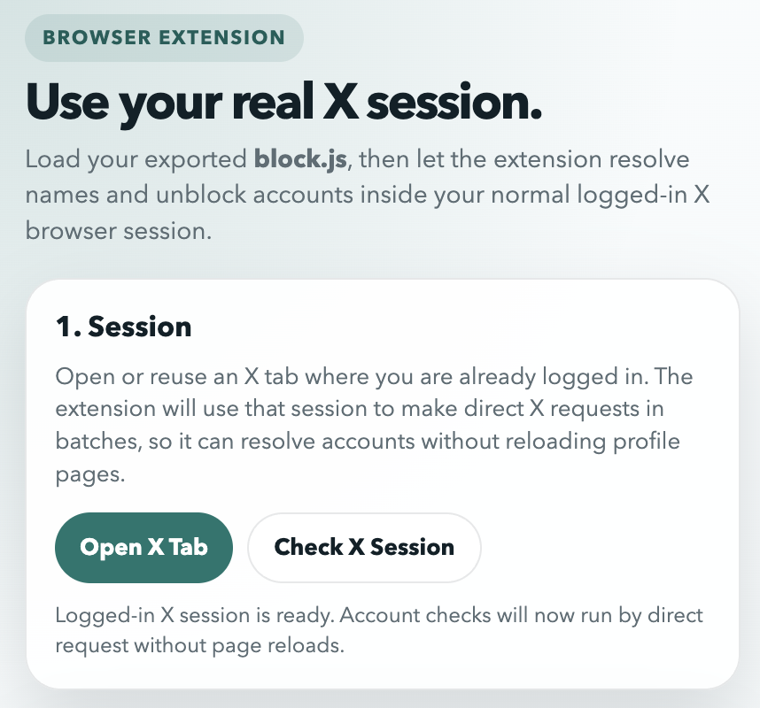
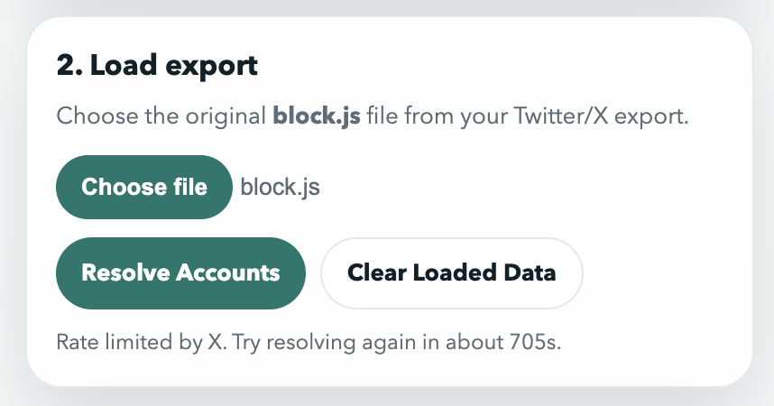
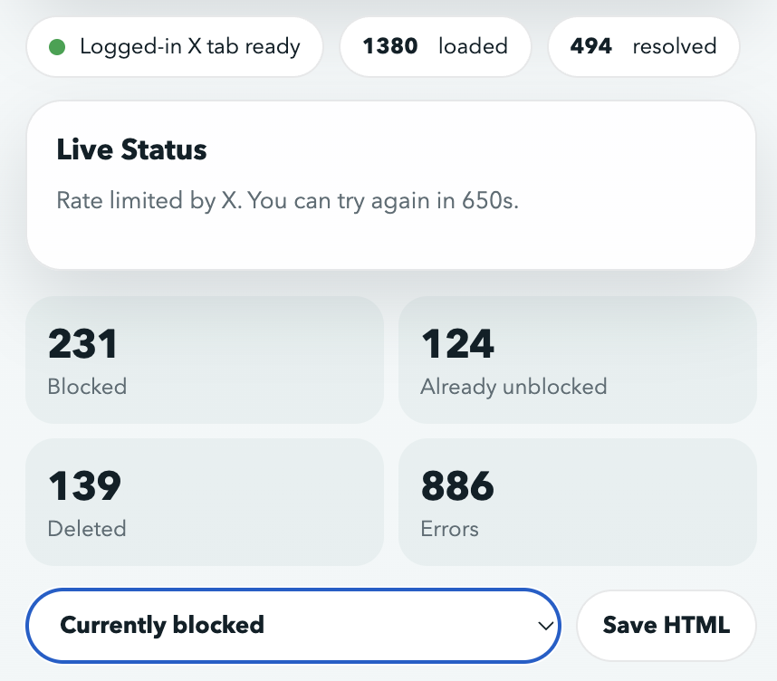

# X Block Manager

Chrome extension for reviewing an exported X/Twitter block list from `block.js`, resolving account names where possible, identifying deleted or already-unblocked accounts, and unblocking accounts from the extension popup.

It is built for people who downloaded their X archive and discovered that the exported block list mostly contains account IDs instead of readable names.

## Why This Exists

X exports blocked accounts as IDs in `block.js`. That is useful as raw data, but not very practical if you want to:

- see who those accounts actually are
- find accounts that no longer exist
- spot accounts that are already unblocked
- work through the list in a more human-friendly way

`X Block Manager` uses your normal logged-in X session in Chrome to make that archive easier to work with. It does not require an X API key.

## Features

- Load a `block.js` file from your X archive
- Resolve display names and usernames when X still exposes them
- Mark accounts that appear to be deleted or unavailable
- Show whether an account is currently blocked or already unblocked
- Unblock accounts directly from the extension popup
- Filter the list by status
- Save the currently visible list as a standalone HTML file
- Resume after X rate limits you instead of starting over

## Who This Is For

This project is a good fit if:

- you have downloaded your X archive
- you have a `block.js` file
- you want a better view of the accounts in that export
- you are comfortable loading an unpacked Chrome extension

## What You Need

Before you start, make sure you have:

1. A desktop version of Google Chrome or another Chromium browser that supports unpacked extensions.
2. A normal X account that you can log in to on `x.com`.
3. A downloaded X archive that contains your `block.js` file.
4. This project checked out on your computer.

## What `block.js` Is

`block.js` is part of the archive you can request from X. It contains the accounts that were in your block list at the time the archive was created.

This extension expects the exported file from X, which typically looks like this:

```js
window.YTD.block.part0 = [...]
```

If you do not have that file yet, you need to request and download your X archive first.

Official X help pages:

- Download your archive: [How to download your X archive](https://help.x.com/en/managing-your-account/how-to-download-your-twitter-archive.html)
- Account data overview: [How to access and download your X data](https://help.x.com/en/managing-your-account/accessing-your-x-data)
- Block list basics: [Blocking on X](https://help.x.com/en/using-x/blocking-and-unblocking-accounts)
- Manage blocked accounts on X: [How to manage your block list](https://help.x.com/en/using-x/advanced-x-block-options)

## How To Get Your `block.js` File

1. Log in to X.
2. Open your account settings and request your X archive.
3. Wait until X tells you the archive is ready.
4. Download the archive ZIP file from X.
5. Unzip it on your computer.
6. Search the extracted files for `block.js`.

Tips:

- The exact folder name inside the archive can vary, so searching for the filename is usually the easiest approach.
- If you open the file in a text editor, it should begin with `window.YTD.block.part0 =`.
- Treat this file as personal data. It is your block list export.

## Quick Start

1. Open Chrome and go to `chrome://extensions`.
2. Turn on **Developer mode** in the top-right corner.
3. Click **Load unpacked**.
4. Select this project folder.
5. Open a normal browser tab on [https://x.com/home](https://x.com/home).
6. Log in to X in that tab.
7. Open the extension popup.
8. Click **Check X Session**.
9. Use the file picker to select your `block.js`.
10. Click **Resolve Accounts**.

After installation, the extension appears as **X Block Manager**.

## What It Looks Like

The popup is taller than a single screenshot, so the interface is shown here in three stacked sections.

The screenshots intentionally avoid showing any real blocked-account entries.

### Top Section



### Middle Section



### Lower Section



## Everyday Use

Once your export is loaded, the popup shows:

- how many accounts were loaded
- how many have been resolved
- a live status panel
- a list of accounts from your export
- a filter dropdown
- a `Save HTML` button

Typical workflow:

1. Open a logged-in X tab.
2. Open the extension.
3. Click **Check X Session** if needed.
4. Load your `block.js` if it is not already loaded.
5. Click **Resolve Accounts**.
6. Watch the **Live Status** panel while the extension works.
7. Use the filter dropdown to focus on one status at a time.
8. Click **Unblock** for any account you want to unblock.
9. Click **Save HTML** if you want an export of the currently displayed rows.

## What The Statuses Mean

### `Currently blocked`

The extension found the account and believes it is still in your current X block list.

### `Already unblocked`

The account exists, but it does not appear to be in your current X block list anymore.

### `ACCOUNT DELETED`

X did not return a usable account for that ID. In practice, this can mean:

- the account was deleted
- the account was suspended
- the account was renamed or made otherwise unavailable to the current lookup method

So this label is best understood as "not available through the current lookup flow."

### `Errors`

An error means the extension could not finish checking that account cleanly. This can happen if X changes its internal web requests, rejects a request, or rate-limits the session.

## Filters And HTML Export

The filter dropdown lets you show:

- `All`
- `Currently blocked`
- `Already unblocked`
- `ACCOUNT DELETED`

The filter only changes what is shown in the popup. It does not delete or change your saved results.

The selected filter is remembered, so if you close and reopen the popup it should stay on the same filter.

`Save HTML` exports exactly what is currently visible in the list. That makes it easy to create a human-readable snapshot of all accounts or just one status category.

## Rate Limiting And Resume Behavior

X may rate-limit the extension while it is checking many accounts.

When that happens:

- the popup shows a message explaining that X is rate-limiting requests
- a countdown shows how long you should wait before trying again
- already resolved accounts stay saved
- the next time you click **Resolve Accounts**, the extension continues with unresolved accounts instead of starting over

This is especially useful for large block lists.

## What Gets Saved Locally

The extension stores its working data in Chrome extension storage on your computer, including:

- the accounts loaded from your `block.js`
- resolved names and usernames
- the latest known status for each account
- the selected filter
- the remembered X session/tab state

This is done so you can close and reopen the popup without losing your progress.

## Privacy And Safety Notes

- Your `block.js` file is personal data. Do not commit it to a public repository.
- Exported HTML files can also contain personal block-list information. Treat them as private unless you intentionally want to share them.
- This extension works through your own logged-in X session. Keep that in mind if other people use the same Chrome profile.
- The extension uses Chrome permissions for `storage`, `tabs`, and `scripting`, plus access to `x.com` and `twitter.com`, because it needs to read and act within your logged-in X session.

## Troubleshooting

### The popup says `No X tab checked yet.`

Open a normal logged-in X tab and click **Check X Session** again.

### The popup says the current X tab does not have a usable logged-in session.

Make sure you are actually logged in on `x.com`, not just sitting on a logged-out or partially loaded page. Refresh the tab and try again.

### `Resolve Accounts` seems slow.

That is normal for large block lists. X may also rate-limit requests, which can pause progress for several minutes at a time.

### I only see IDs for some accounts.

That usually means X no longer returns normal profile data for those accounts. They may be deleted, suspended, or otherwise unavailable.

### Some accounts say `Already unblocked`.

That means they were in the archive when you downloaded it, but they do not appear to be blocked in your current live X session anymore.

### The extension stops after only a few accounts.

Check the **Live Status** panel. If X has rate-limited the session, wait for the countdown and then click **Resolve Accounts** again.

### An account does not unblock when I click the button.

X may have changed something in the web flow, or the session may no longer be valid. Re-check the X session and try again.

## Updating Or Resetting Your Data

If you want to start over with a fresh export:

1. Open the extension popup.
2. Click **Clear Loaded Data**.
3. Load a different or newer `block.js`.
4. Run **Resolve Accounts** again.

## Uninstalling

If you no longer want the extension:

1. Open `chrome://extensions`.
2. Find **X Block Manager**.
3. Click **Remove**.

If you also want to remove your local data:

1. Use **Clear Loaded Data** before uninstalling, if you want the extension itself to forget the loaded results first.
2. Delete any local copies of `block.js` that you no longer want to keep.
3. Delete any HTML files you exported with `Save HTML`.

## Project Files

- `manifest.json`: Chrome extension manifest
- `popup.html`: popup UI
- `popup.js`: popup logic, file parsing, rendering, filters, export handling
- `service-worker.js`: background worker for X session checks, account resolution, and unblocking

## Limitations

- This project depends on X's current web behavior and can break if X changes its internal requests or page behavior.
- Large block lists can take time because X may rate-limit lookups.
- `ACCOUNT DELETED` should be read as "not available through the current X lookup flow," not as a guaranteed permanent deletion state.

## License

MIT. See [LICENSE](LICENSE).
